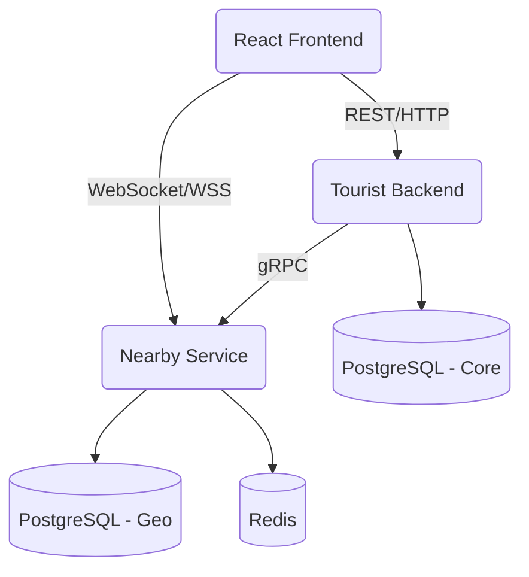

# 🗺️ ExploreNow Architecture

A high-performance, real-time Tourist Platform leveraging a microservice architecture to deliver interactive spatial features, secure real-time connections, and robust core business logic.

---

## 🏗️ System Overview

The application is structured into three primary domains, adopting an API Gateway and Microservice pattern for isolation and scalability.

---

## 📁 1. Microservice Boundaries

### 📱 Frontend (`/client`)
- **Framework**: React, Vite, TailwindCSS
- **State Management**: React Query (`@tanstack/react-query`)
- **Mapping**: `react-leaflet` with custom privacy-first "fuzzy" jitter algorithms.
- **Real-time**: `socket.io-client` with persistent connection logic.
- **Deployment**: Vercel

### 🛡️ Tourist Backend (API Gateway) (`/server`)
- **Framework**: Express.js
- **Responsibilities**: User Authentication (Passport.js), Bookings, core CRUD operations, and proxying nearby-traffic.
- **Database Layer**: Drizzle ORM connecting to PostgreSQL.
- **Proxying**: Acts as a reverse-proxy utilizing `@grpc/grpc-js` to securely communicate with the geo-service.
- **Deployment**: Render (Web Service)

### 🌍 Nearby Service (`/nearby-service`)
- **Framework**: Express.js + gRPC (`@grpc/grpc-js`) + WebSockets (`socket.io`).
- **Responsibilities**: Real-time location tracking, H3 Spatial grid mapping, and peer-to-peer connection brokering.
- **Database Layer**: Prisma ORM (PostgreSQL) + Redis (Pub/Sub & Caching).
- **Deployment**: Render (Web Service running Docker)

---

## ⚙️ Core Technical Decisions

### The Fireball Algorithm
To prevent the server from becoming overwhelmed by thousands of active users, the backend **never polls the client**. Instead, the client independently evaluates changes and only broadcasts a location update if:
1. They moved > 50 meters
2. Their H3 spatial cell boundary changed
3. 2 minutes elapsed
4. Speed/Direction significantly changed

### Uber H3 Spatial Indexing
Raw GPS coordinates are computationally expensive to calculate proximity for at scale. We map GPS coordinates to **Uber H3 hexagons** at resolution 8. When a user requests nearby strangers, we calculate proximity using `k-ring` traversal on the grid in Redis/memory, returning lightning-fast O(1) neighbor lookups.

### Privacy-First Architecture
Raw GPS coordinates are strictly prohibited from leaving the backend without a mutual bidirectional handshake:
- **Strangers**: Receive an `approximateDistanceMeters`. The frontend calculates a randomized "Fuzzy Coordinate" jitter to mask exact positions.
- **Friends**: Upon emitting `CONNECTION_ACCEPTED` over WebSocket, precise GPS data is unlocked.

### Authentication Flow
We utilize a **Shared JWT Authentication** strategy. 
The Gateway handles session/cookie validation. Upon request, it signs a short-lived JWT using a shared secret. 
1. The Frontend passes this JWT to establish a secure WebSocket pipeline to the microservice.
2. The Gateway passes this JWT into gRPC Metadata for highly secure Service-to-Service authorization.

---

## 📈 Render & Docker Deployment

The application utilizes Render's robust infrastructure:
- **Gateway**: Native Node.js deployment.
- **Nearby Service**: Multi-stage `Dockerfile` (Alpine Node 20).
  - Includes a `HEALTHCHECK` directive for container self-healing.
  - Exposes Port 10000 (HTTP/WS) publicly, and Port 50051 (gRPC) privately.
- **Scaling**: Utilizing `@socket.io/redis-adapter` linked to a production Redis cluster. If traffic spikes, Render can horizontally scale the `nearby-service` to 10+ instances without losing real-time event consistency.

---

## 💡 Recommended Improvements

While the current architecture is robust and highly functional, here are professional recommendations for the next phase of scale:

1. **Service Mesh / Circuit Breakers**
   - *Current State*: The Gateway forwards REST requests to the Nearby Service via gRPC synchronously.
   - *Improvement*: Implement a Circuit Breaker (e.g., `opossum`) in the Gateway. If the Nearby Service experiences downtime, the Gateway should fail-fast and return degraded UI states to the client rather than hanging the core Gateway thread pool.

2. **Schema & ORM Unification**
   - *Current State*: The Gateway uses `Drizzle ORM` while the Nearby Service uses `Prisma ORM`. Types are defined in `/shared` but duplicated in `nearby-service/prisma/schema.prisma`.
   - *Improvement*: Extract the database layer into a true Monorepo package workspace using turborepo or npm workspaces. Standardize on one ORM to reduce bundle size, developer cognitive load, and CI/CD generation steps.

3. **PostGIS Integration**
   - *Current State*: H3 indexing is computed in memory/Node.js and cached in Redis.
   - *Improvement*: As the user base scales to millions, native `PostGIS` extensions in PostgreSQL combined with H3 extensions will allow the database to offload spatial filtering at the query level, reducing the memory footprint on the Node.js microservice.

4. **WebSocket Security (CORS/WAF)**
   - *Current State*: The WebSocket server currently accepts origins from `*` to ensure rapid MVP development.
   - *Improvement*: Lock down the `SocketManager` CORS origin strictly to the Vercel production domain. Implement a WAF rate-limiter on the WebSocket handshake to prevent connection-flood DDoS attacks.
